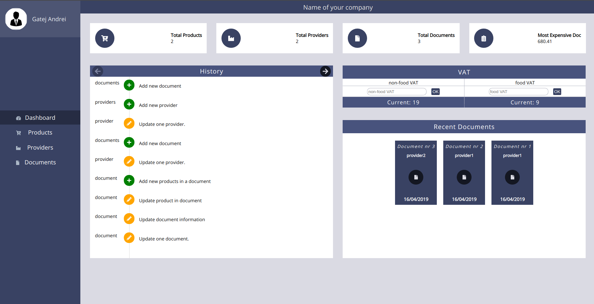
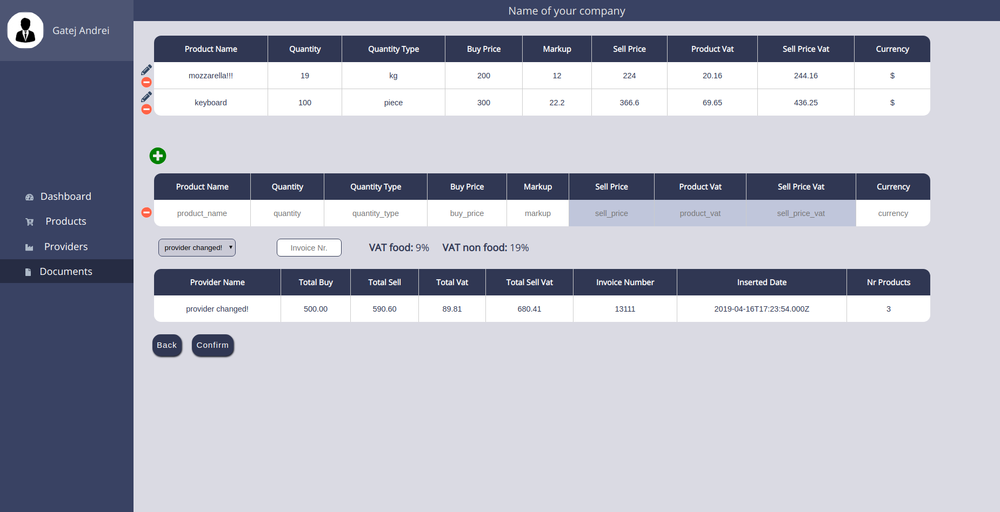

## Invoice App

An application meant to facilitate the process of writing up a traditional invoice.
Keeping track of goods sent and services provided should be a computer's job.

## [Demo](https://www.youtube.com/watch?v=BpFPk3wXWZk&t=4s)

## Screenshots

<div style="text-align: center;">

</div>
<br>
<div style="text-align: center;">

</div>

## Getting Started
```bash
git clone https://github.com/Andrei0872/invoice-app.git
```

```bash
cd client/ && npm i && cd - && cd server/ && npm i && cd -
```

```bash
cp .env .env.example
# Then, add the information needed
```

```bash
# Open a new terminal tab (CTRL + SHIFT + T)
cd client/ && npm run serve
cd server/ && npm run dev
```

## App structure 
```
.
├── client
│   ├── dist
│   ├── src
│   ├── babel.config.js
│   ├── package.json
│   ├── package-lock.json
│   └── vue.config.js
├── server
│   ├── controllers
│   ├── db
│   ├── routes
│   ├── services
│   ├── utils
│   ├── app.js
│   ├── .env
│   ├── .env.example
│   ├── package.json
│   └── package-lock.json
└── readme.md
```

## Todos

* [ ] Allow the user to save a PDF
* [ ] Add Login System
* [ ] Add i18n
